# Bookkeeper

An accounting program that works with an SQL database.

The program has:
- client module - adding customer details, contact details, address, bank account numbers
- invoicing module - issuing sales invoices, as well as corrections
- purchasing module - entering purchase invoices and corrections
- settlement module - settlement of bank statements and cash registers, module for monitoring settlements with customers
- accounting module - issuing vouchers, accounting reports, balance sheet, journal, reports can be exported to CSV or XLS, opening balance.
- the ability to run several companies.

To run copy all files and run main.py. At the beginning, after starting, you need to configure the connection to the SQL database in the settings tab.

Customer receivables and liabilities
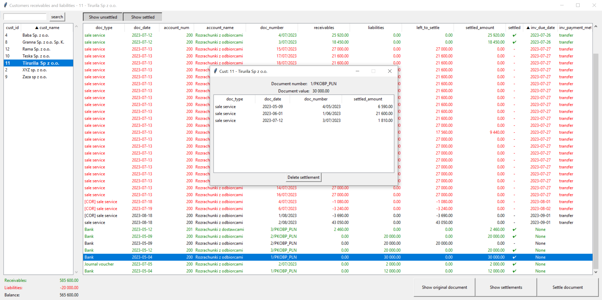

Sales invoice
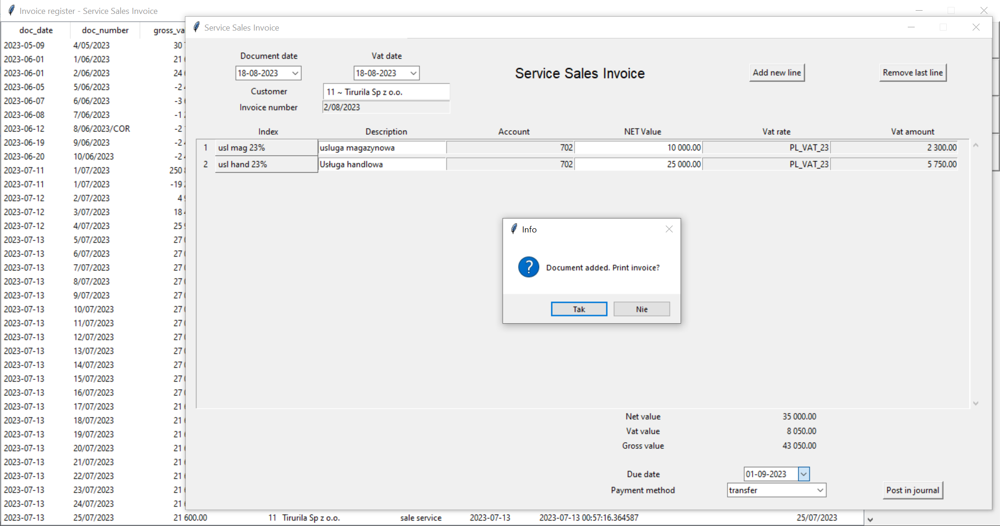

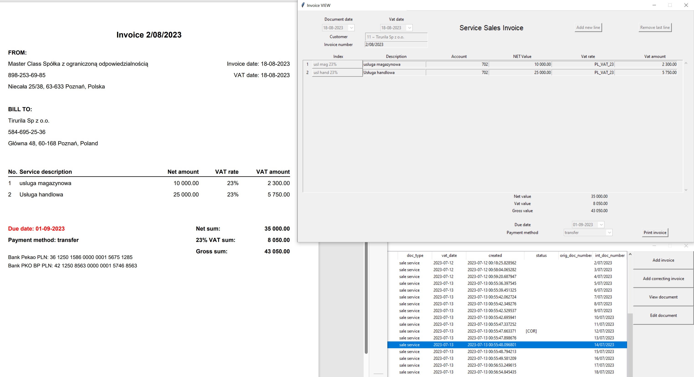

Correcting sales invoice
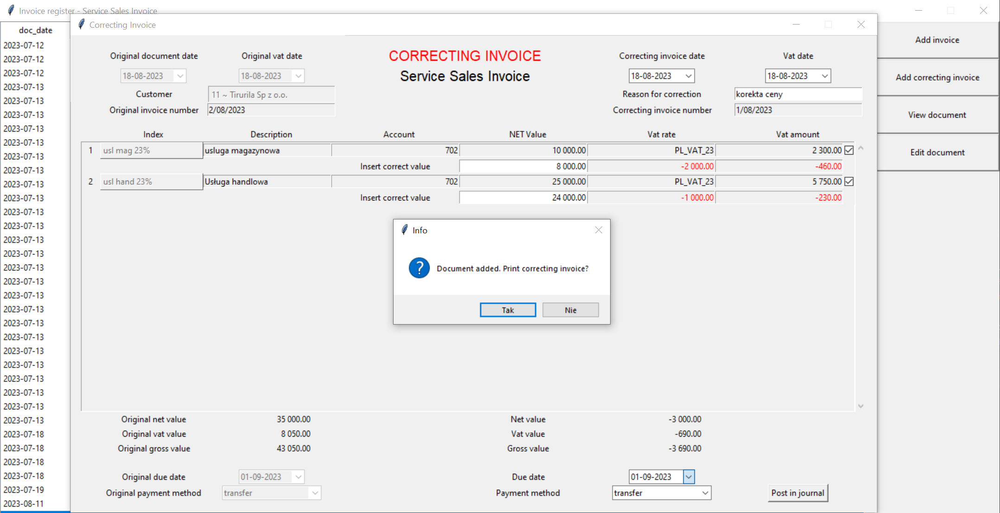

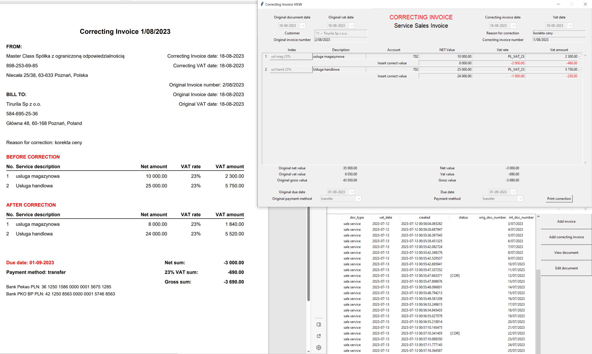

Invoice indexes
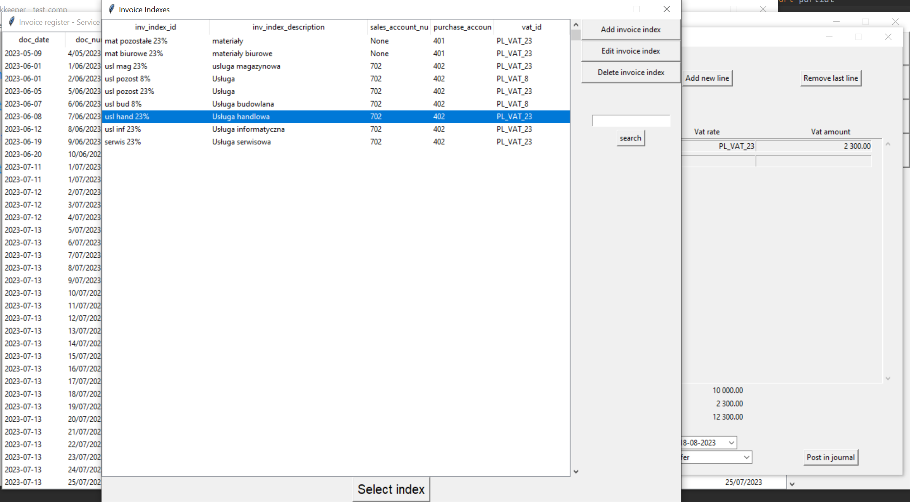

Customers
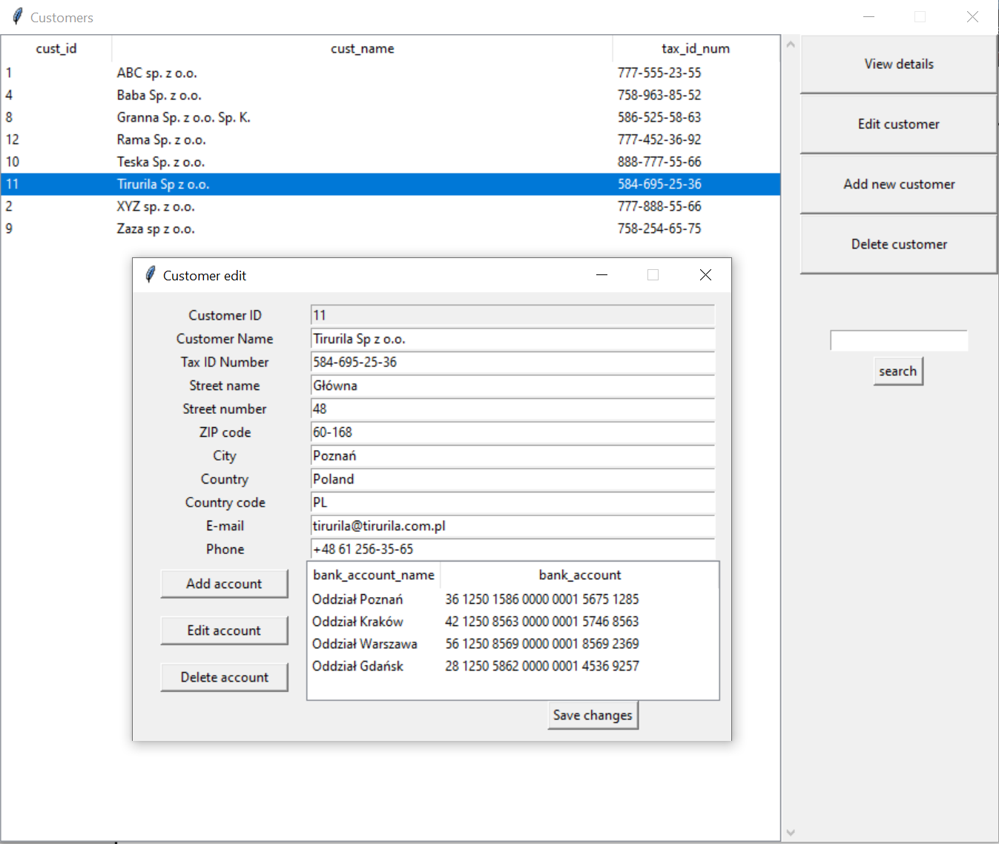

Bank
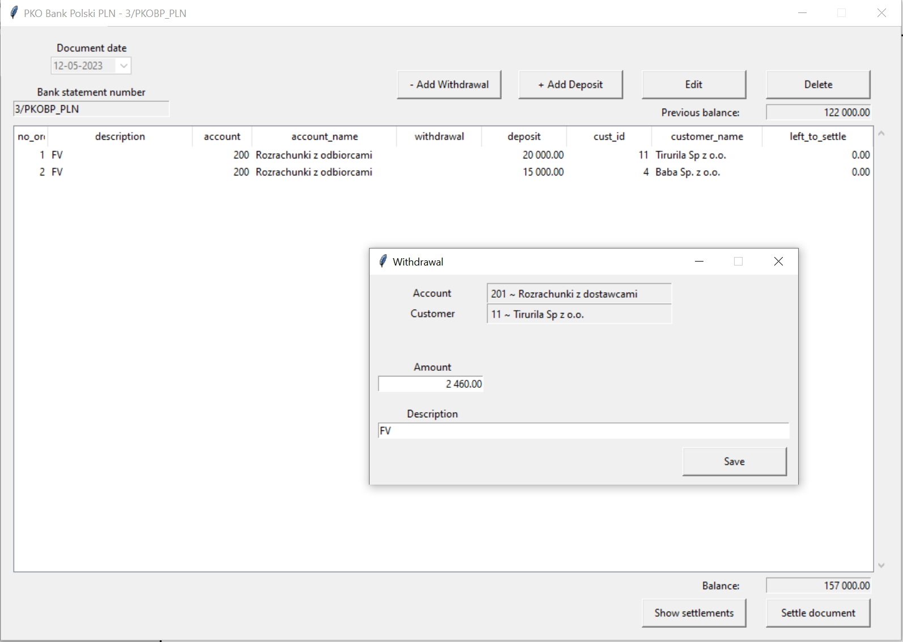

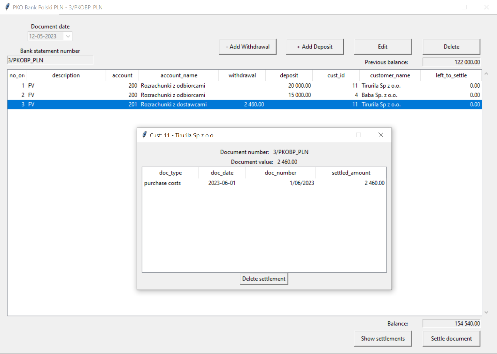

Customer settlement
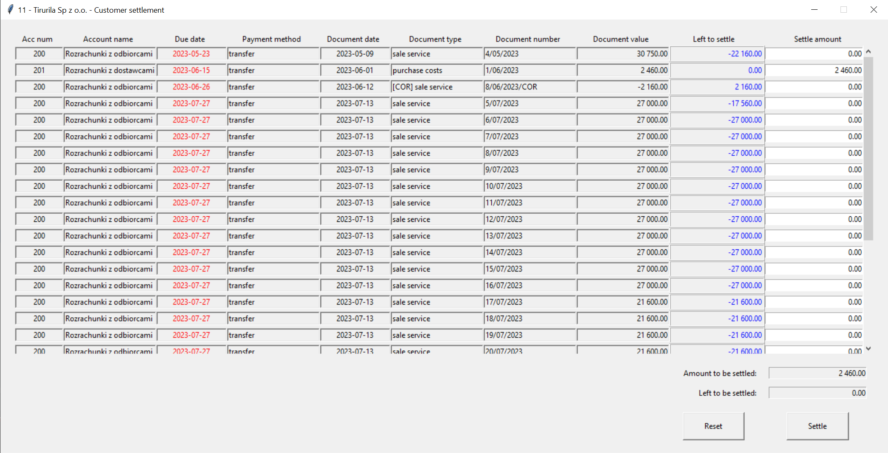

Voucher
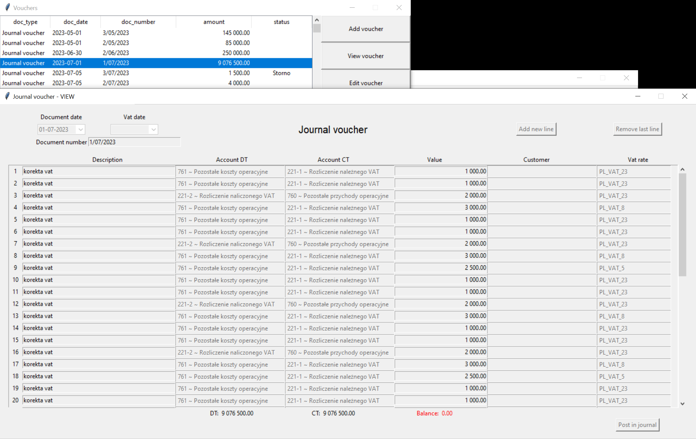

Chart of accounts
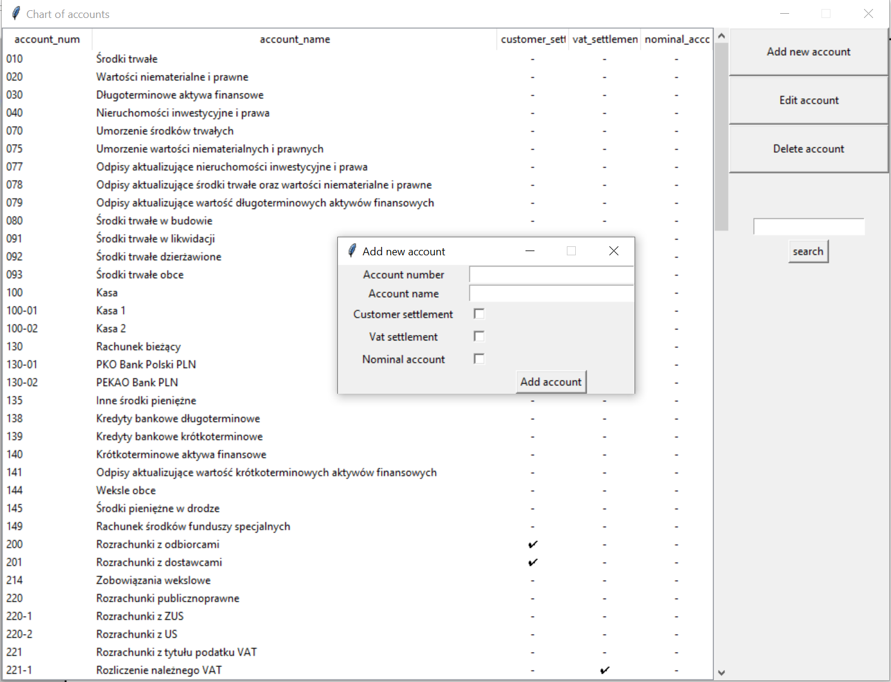

Trial balance
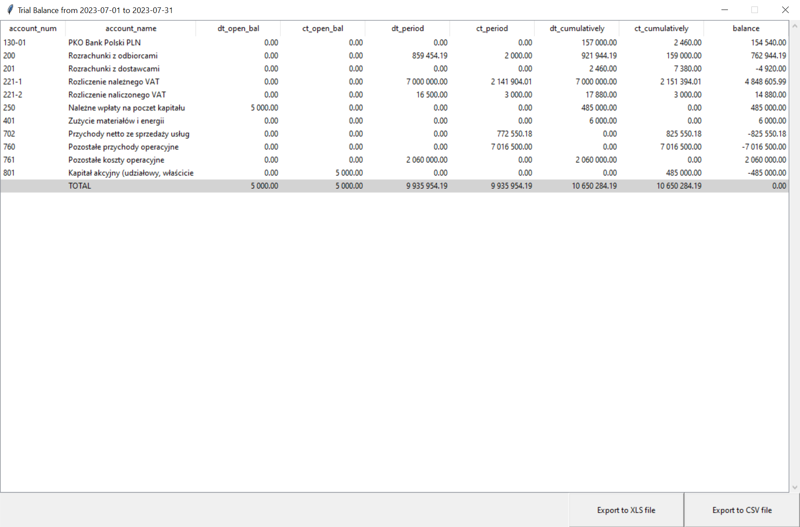

Journal
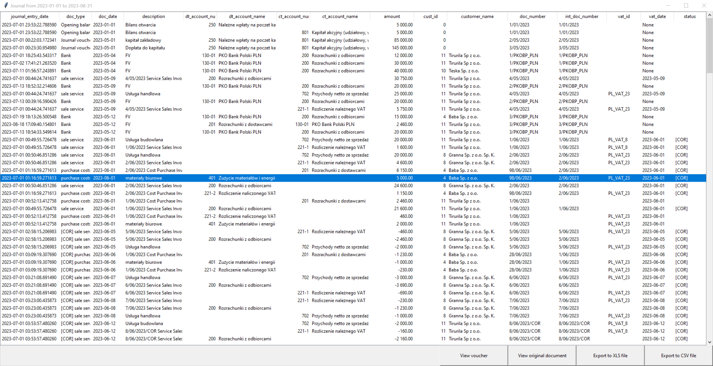

Settings
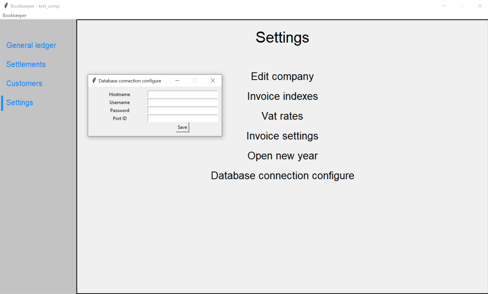
